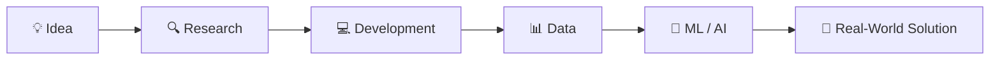

<div align="center">


### 👋 Hey there, I'm Shariar Dipto

**CSE Graduate • Data Science PGD • Developer • AI & ML Enthusiast**

<br/>

<a href="https://github.com/shariardipto">
  
</a>
<a href="https://www.linkedin.com/in/shariar.dipto">
  
</a>
<a href="https://www.facebook.com/shariar.dipto">
  
</a>
<a href="https://www.instagram.com/shariar.dipto">
  
</a>

<br/><br/>


</div>

<br/>

---

## 🚀 About Me


I'm **Shariar Dipto**, a **Computer Science & Engineering graduate** with a strong interest in building modern software and exploring intelligent systems.

🎓 I have completed a **Post Graduate Diploma (PGD) in Data Science from United International University (UIU)** alongside my **Bachelor's degree in Computer Science & Engineering (CSE)**.

💻 Currently, I'm strengthening my modern web development skills with **React, TypeScript, JavaScript, Next.js, Node.js and related technologies**.

🧠 At the same time, I'm actively exploring **Data Science, Machine Learning, Artificial Intelligence and AI Modeling** using tools such as **Python, NumPy, Pandas, PyTorch and TensorFlow**.

⚡ I enjoy working at the intersection of **Software Engineering + Data + AI**, turning ideas and real-world problems into practical digital solutions.

<br/>

<div align="center">

[](https://git.io/typing-svg)

</div>

<br clear="right"/>

---

## 🎯 What I'm Currently Focused On

```text
🌐  Modern Web Development
     ├── JavaScript
     ├── TypeScript
     ├── React
     ├── Next.js
     └── Node.js

🧠  Data Science & Artificial Intelligence
     ├── Python
     ├── Data Analysis
     ├── Machine Learning
     ├── Deep Learning
     └── AI Modeling

🛠️  Building Real-World Projects
     └── Newsroom Dashboard
```

* ⚛️ Improving my skills in **React, TypeScript & modern frontend development**
* ▲ Exploring **Next.js** and scalable web application architecture
* 🟢 Working with **Node.js** and JavaScript-based backend technologies
* 📊 Strengthening my knowledge of **Data Analysis & Data Science**
* 🤖 Exploring **Machine Learning, Deep Learning & AI Modeling**
* 🔥 Building and improving **real-world projects**
* 📚 Continuously learning new technologies and engineering practices

---

# 🔥 Featured Project

<div align="center">

### 📰 Newsroom Dashboard


<br/><br/>

<b>A modern newsroom workflow and operations management system.</b>

<br/><br/>

Built to organize and streamline real-world newsroom operations,  
content workflows, team collaboration and publishing processes.

<br/><br/>

<a href="https://github.com/shariardipto/Newsroom_Dashboard">
  
</div>

One of the projects I'm currently actively working on.

**Newsroom Dashboard** is part of my journey toward building practical software solutions for real-world workflows and operational requirements.

> 🚧 **Status:** Actively being developed and improved.

---

# 🎓 Education

<div align="center">

| 🎓 Qualification                | 🏫 Institution / Field                                   |
| :------------------------------ | :------------------------------------------------------- |
| **Post Graduate Diploma (PGD)** | **Data Science — United International University (UIU)** |
| **Bachelor's Degree**           | **Computer Science & Engineering (CSE)**                 |

</div>

---

# 💻 Tech Stack

## 🌐 Frontend Development

<div align="center">


</div>

<br/>

<div align="center">


</div>

---

## ⚙️ Backend & Development

<div align="center">


<br/><br/>


</div>

---

## 🧠 Data Science • Machine Learning • AI

<div align="center">


<br/><br/>


</div>

---

# 🧩 My Development Journey



<div align="center">

### `Code. Learn. Experiment. Build. Improve. Repeat.`

</div>

---

# 📊 GitHub Analytics

<div align="center">


<br/><br/>


</div>

---


## 🐍 Watch My Contributions Get Eaten!

<div align="center">

<picture>
  <source media="(prefers-color-scheme: dark)" srcset="https://raw.githubusercontent.com/shariardipto/shariardipto/gh-pages/github-contribution-grid-snake-dark.svg">
  <source media="(prefers-color-scheme: light)" srcset="https://raw.githubusercontent.com/shariardipto/shariardipto/gh-pages/github-contribution-grid-snake.svg">
  
</picture>

</div>

---

# 🤝 Connect With Me

<div align="center">

### Let's connect, collaborate and build something meaningful 🚀

<br/>

<a href="https://www.facebook.com/shariar.dipto">
  
</a>

<a href="https://www.instagram.com/shariar.dipto">
  
</a>

<a href="https://www.linkedin.com/in/shariar.dipto">
  
</a>

<a href="https://github.com/shariardipto">
  
</a>

<br/><br/>

### 💻 Software Development × 📊 Data Science × 🧠 Artificial Intelligence

<br/>


</div>
